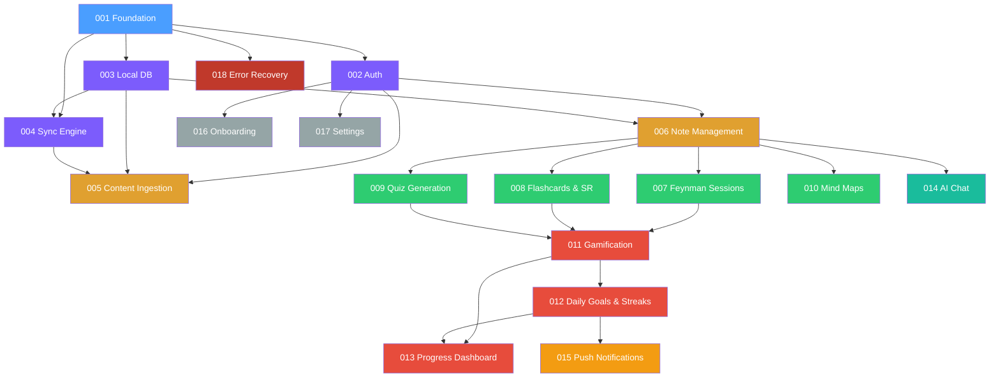

# Feynman – Feature Specifications Roadmap

> Master list of every spec needed to implement the full product.
> Each row = one `/speckit.specify` invocation you will trigger later.

## Guiding Rationale

Features are sequenced by **strict dependency order**: nothing in
Phase N may depend on anything in Phase N+1. Within a phase, specs
are numbered for suggested order but are *laterally independent*
unless noted.

Boundaries were drawn by asking:
1. **Independently deployable?** – can this deliver user value alone?
2. **Single responsibility** – does it map to one SPEC.md capability?
3. **Testable in isolation** – can it be verified without later phases?

---

## Phase 0 — Foundation

> Scaffolding, DI wiring, theme, navigation. **No user-facing features;
> everything else depends on this.**

| # | Spec Name | Covers | Constitution Tie-in |
|---|-----------|--------|---------------------|
| `001` | **Foundation & Base Architecture** | Project scaffold, Clean-Architecture layers (`core/`, `features/`), Riverpod DI, GoRouter navigation shell, app theme & design tokens, error-boundary scaffold, centralized logger, Drift DB bootstrap, Supabase client init | I, IV, V, VII, VIII |

---

## Phase 1 — Core Infrastructure

> Auth, local persistence, and sync — the three pillars every feature
> reads/writes through.

| # | Spec Name | Covers | Constitution Tie-in |
|---|-----------|--------|---------------------|
| `002` | **Authentication & User Management** | Supabase Auth integration (email/password + Google OAuth), secure token storage (flutter_secure_storage), session lifecycle, auth state provider, profile CRUD, logout/account-delete, deep-link auth callbacks | I, V, VI |
| `003` | **Local Database & Offline Storage** | Full Drift/SQLite schema (notes, folders, flashcards, quizzes, sessions, gamification, sync_queue), DAOs, migrations framework, seed data, offline read/write contracts | I, II, III |
| `004` | **Sync Engine & Conflict Resolution** | Background sync queue, version-vector conflict detection, last-write-wins + user-prompt merge, connectivity monitor, retry with exponential backoff, WorkManager / Service Worker integration, sync status indicators | II, IV, VIII |

---

## Phase 2 — Content Pipeline

> Ingestion + note storage. Users can create & browse learning material
> after this phase.

| # | Spec Name | Covers | Constitution Tie-in |
|---|-----------|--------|---------------------|
| `005` | **Content Ingestion Pipeline** | Six source types (audio record/upload, PDF, YouTube URL, web URL, image OCR, plain text), Edge Function processing (Deno), chunked upload, progress tracking UI, transcription, AI summarization, structured output generation | I, IV, VI, VIII |
| `006` | **Note Management & Organization** | Note CRUD, AI-generated summary display, sections/definitions/examples, folder system (color + icon), tagging, archive/pin, full-text search, note detail view, empty states | I, II, V, VII |

---

## Phase 3 — Active Learning Features

> The four learning activities. Each is independently usable once a
> note exists.

| # | Spec Name | Covers | Constitution Tie-in |
|---|-----------|--------|---------------------|
| `007` | **Feynman Technique Sessions** | Session creation (text/voice), AI analysis across 4 dimensions (clarity, accuracy, structure, examples), scoring, feedback display, multi-attempt tracking, mastery thresholds, clarity-score progression chart | I, IV, V, VIII |
| `008` | **Flashcard System & Spaced Repetition** | AI card generation from notes, front/back + hint, modified SM-2 algorithm, scheduling engine (new → learning → review → lapsed), per-card stats (ease, interval, reps, lapses), review session UI | I, II, III, V |
| `009` | **Quiz Generation & Assessment** | Auto-generation (MCQ, true/false, fill-in-blank), difficulty tagging, timed responses, immediate feedback with explanations, score history, best-score tracking | I, III, V |
| `010` | **Mind Map Visualization** | Concept extraction from notes, hierarchical node graph, expand/collapse branches, zoom/pan, node color customisation, interactive navigation | I, V, VII |

---

## Phase 4 — Engagement & Progress

> Gamification, goals, and analytics that keep users coming back.

| # | Spec Name | Covers | Constitution Tie-in |
|---|-----------|--------|---------------------|
| `011` | **Gamification Engine** | XP award rules (Feynman, flashcards, quizzes, streaks), leveling curve, level-up unlocks, achievement badge system (first note, 10/50 notes, 7/30-day streaks, perfect quiz, deck mastery, Feynman mastery tiers) | I, II, V, VII |
| `012` | **Daily Goals & Streak System** | Goal setting (notes/day, cards/day, study-minutes), daily progress tracking, streak increment/reset logic, timezone-aware day boundaries, goal reminders | I, II, V |
| `013` | **Progress Dashboard & Analytics** | Stats overview (streak, XP, level, study time), progress-to-next-level bar, timeline/schedule view (cards due, sessions ready), historical trend charts, per-subject breakdowns | I, V, VII |

---

## Phase 5 — Intelligence Layer

> AI-powered conversational features.

| # | Spec Name | Covers | Constitution Tie-in |
|---|-----------|--------|---------------------|
| `014` | **AI Chat Assistant** | Note-contextual chat interface, conversation history, Edge Function for LLM orchestration, streaming responses, source-citation, follow-up suggestions | I, IV, VI, VIII |

---

## Phase 6 — Notifications & Communication

> Proactive engagement via push.

| # | Spec Name | Covers | Constitution Tie-in |
|---|-----------|--------|---------------------|
| `015` | **Push Notifications & Reminders** | FCM setup (Android), Web Push API, review-due reminders, streak-at-risk alerts, daily-goal nudges, notification preferences, end-to-end delivery tracking | IV, VI, VIII |

---

## Phase 7 — Onboarding & Settings

> First-run experience + user preferences.

| # | Spec Name | Covers | Constitution Tie-in |
|---|-----------|--------|---------------------|
| `016` | **Onboarding & First-Run Experience** | Welcome carousel (Feynman Technique + spaced repetition explainer), initial goal setup, notification opt-in, guided first-note creation, sample content exploration | I, V, VII |
| `017` | **Settings & User Preferences** | Account profile, auth management, notification prefs, theme/appearance, language selection, accessibility, legal docs (ToS, privacy), data export/delete | I, V, VI, VII |

---

## Phase 8 — Resilience & Polish

> Cross-cutting hardening, error UX, and platform polish.

| # | Spec Name | Covers | Constitution Tie-in |
|---|-----------|--------|---------------------|
| `018` | **Error Recovery & Resilience** | Error boundary UI (per-route & per-async-op), retry flows for processing failures, graceful degradation, crash reporting integration (Sentry/Crashlytics), breadcrumb capture, offline-error queuing | IV, VIII |

---

## Dependency Graph



**Legend:**
🔵 Foundation · 🟣 Core Infrastructure · 🟠 Content Pipeline ·
🟢 Active Learning · 🔴 Engagement · 🟦 Intelligence ·
🟡 Notifications · ⚪ Onboarding/Settings · 🟥 Resilience

---

## Summary

| Phase | Specs | Focus |
|-------|-------|-------|
| 0 | 001 | Scaffold & architecture |
| 1 | 002 – 004 | Auth, DB, Sync |
| 2 | 005 – 006 | Content in, notes out |
| 3 | 007 – 010 | Four learning activities |
| 4 | 011 – 013 | Gamification & analytics |
| 5 | 014 | AI chat |
| 6 | 015 | Push notifications |
| 7 | 016 – 017 | Onboarding & settings |
| 8 | 018 | Error resilience |
| **Total** | **18 specs** | **Full product coverage** |

---

## How to Use

```text
# When ready to specify a feature:
@/speckit.specify  <paste the spec name + any extra context>

# Suggested first invocation:
@/speckit.specify  001 – Foundation & Base Architecture
```

Work through specs **in numerical order** (or within-phase in parallel)
to respect the dependency graph above.
