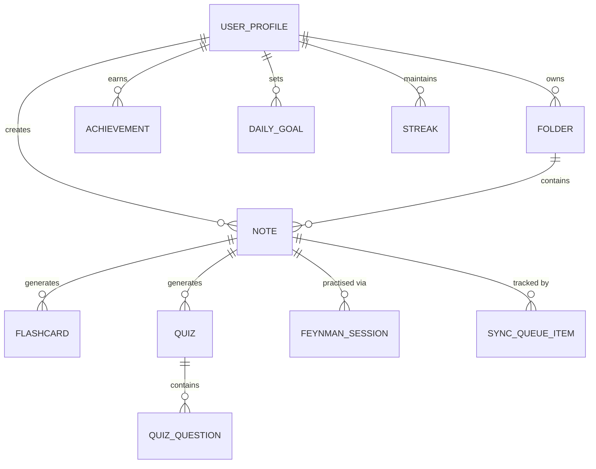
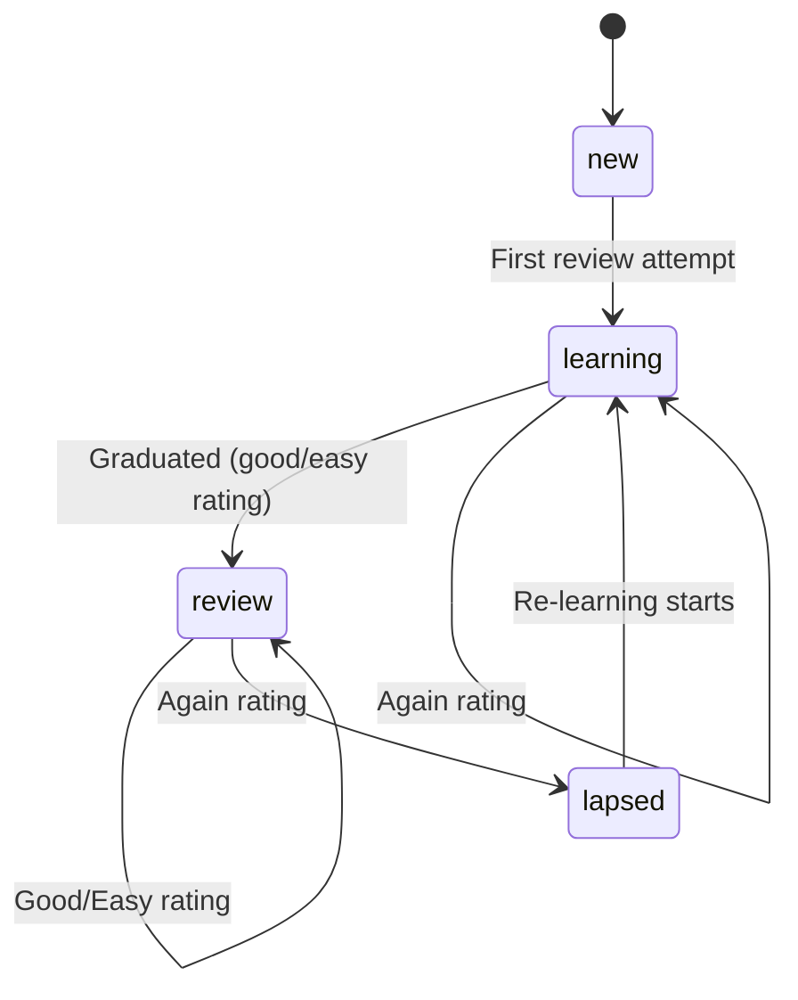
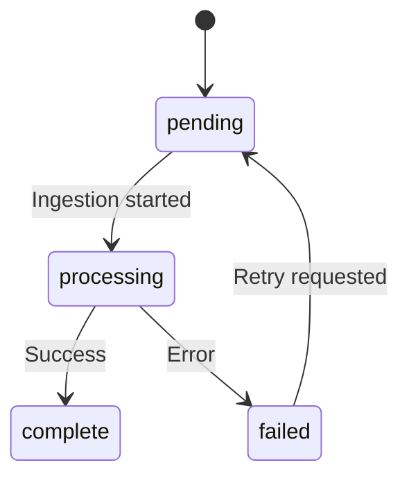
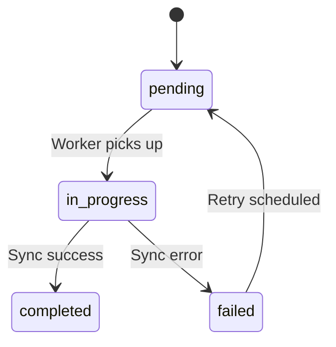

# Data Model: Foundation & Base Architecture

**Feature**: 001-foundation-base-architecture
**Date**: 2026-02-27

> This feature bootstraps the **full database schema** so that downstream
> features (002–018) can depend on tables existing from day one. Individual
> features will later add columns or indices as needed via migrations.

## Entity Relationship Diagram

## Entities

### user_profile

| Column            | Type     | Constraints                   | Notes                            |
|-------------------|----------|-------------------------------|----------------------------------|
| id                | TEXT     | PK                            | Supabase Auth UID                |
| email             | TEXT     | NOT NULL                      |                                  |
| display_name      | TEXT     | NULLABLE                      |                                  |
| avatar_url        | TEXT     | NULLABLE                      |                                  |
| level             | INTEGER  | NOT NULL, DEFAULT 1           | Gamification level               |
| total_xp          | INTEGER  | NOT NULL, DEFAULT 0           |                                  |
| created_at        | DATETIME | NOT NULL, DEFAULT NOW         |                                  |
| updated_at        | DATETIME | NOT NULL, DEFAULT NOW         |                                  |
| version           | INTEGER  | NOT NULL, DEFAULT 1           | Sync version vector              |

### folder

| Column            | Type     | Constraints                   | Notes                            |
|-------------------|----------|-------------------------------|----------------------------------|
| id                | TEXT     | PK, UUID                      |                                  |
| user_id           | TEXT     | FK → user_profile.id, NOT NULL|                                  |
| name              | TEXT     | NOT NULL                      |                                  |
| color             | TEXT     | NOT NULL, DEFAULT '#4A9EFF'   | Hex colour code                  |
| icon              | TEXT     | NULLABLE                      | Icon identifier                  |
| sort_order        | INTEGER  | NOT NULL, DEFAULT 0           |                                  |
| is_deleted        | BOOLEAN  | NOT NULL, DEFAULT FALSE       | Soft-delete for grace period     |
| deleted_at        | DATETIME | NULLABLE                      |                                  |
| created_at        | DATETIME | NOT NULL, DEFAULT NOW         |                                  |
| updated_at        | DATETIME | NOT NULL, DEFAULT NOW         |                                  |
| version           | INTEGER  | NOT NULL, DEFAULT 1           |                                  |

### note

| Column            | Type     | Constraints                   | Notes                            |
|-------------------|----------|-------------------------------|----------------------------------|
| id                | TEXT     | PK, UUID                      |                                  |
| user_id           | TEXT     | FK → user_profile.id, NOT NULL|                                  |
| folder_id         | TEXT     | FK → folder.id, NULLABLE      | NULL = unfiled                   |
| title             | TEXT     | NOT NULL                      |                                  |
| source_type       | TEXT     | NOT NULL                      | audio/pdf/youtube/web/image/text |
| source_url        | TEXT     | NULLABLE                      | Original URL or file path        |
| summary           | TEXT     | NULLABLE                      | AI-generated summary             |
| content           | TEXT     | NULLABLE                      | Structured content JSON          |
| definitions       | TEXT     | NULLABLE                      | Key definitions JSON array       |
| examples          | TEXT     | NULLABLE                      | Examples JSON array              |
| tags              | TEXT     | NULLABLE                      | Comma-separated tags             |
| is_pinned         | BOOLEAN  | NOT NULL, DEFAULT FALSE       |                                  |
| is_archived       | BOOLEAN  | NOT NULL, DEFAULT FALSE       |                                  |
| processing_status | TEXT     | NOT NULL, DEFAULT 'pending'   | pending/processing/complete/failed|
| created_at        | DATETIME | NOT NULL, DEFAULT NOW         |                                  |
| updated_at        | DATETIME | NOT NULL, DEFAULT NOW         |                                  |
| version           | INTEGER  | NOT NULL, DEFAULT 1           |                                  |

### flashcard

| Column            | Type     | Constraints                   | Notes                            |
|-------------------|----------|-------------------------------|----------------------------------|
| id                | TEXT     | PK, UUID                      |                                  |
| note_id           | TEXT     | FK → note.id, NOT NULL        |                                  |
| user_id           | TEXT     | FK → user_profile.id, NOT NULL|                                  |
| front             | TEXT     | NOT NULL                      |                                  |
| back              | TEXT     | NOT NULL                      |                                  |
| hint              | TEXT     | NULLABLE                      |                                  |
| state             | TEXT     | NOT NULL, DEFAULT 'new'       | new/learning/review/lapsed       |
| ease_factor       | REAL     | NOT NULL, DEFAULT 2.5         | SM-2 ease factor (1.3–3.0)       |
| interval_days     | INTEGER  | NOT NULL, DEFAULT 0           | Days until next review           |
| repetition_count  | INTEGER  | NOT NULL, DEFAULT 0           |                                  |
| lapse_count       | INTEGER  | NOT NULL, DEFAULT 0           |                                  |
| due_date          | DATETIME | NULLABLE                      | Next review date                 |
| created_at        | DATETIME | NOT NULL, DEFAULT NOW         |                                  |
| updated_at        | DATETIME | NOT NULL, DEFAULT NOW         |                                  |
| version           | INTEGER  | NOT NULL, DEFAULT 1           |                                  |

### quiz

| Column            | Type     | Constraints                   | Notes                            |
|-------------------|----------|-------------------------------|----------------------------------|
| id                | TEXT     | PK, UUID                      |                                  |
| note_id           | TEXT     | FK → note.id, NOT NULL        |                                  |
| user_id           | TEXT     | FK → user_profile.id, NOT NULL|                                  |
| title             | TEXT     | NOT NULL                      |                                  |
| best_score        | REAL     | NULLABLE                      | Percentage 0–100                 |
| attempt_count     | INTEGER  | NOT NULL, DEFAULT 0           |                                  |
| created_at        | DATETIME | NOT NULL, DEFAULT NOW         |                                  |
| updated_at        | DATETIME | NOT NULL, DEFAULT NOW         |                                  |
| version           | INTEGER  | NOT NULL, DEFAULT 1           |                                  |

### quiz_question

| Column            | Type     | Constraints                   | Notes                            |
|-------------------|----------|-------------------------------|----------------------------------|
| id                | TEXT     | PK, UUID                      |                                  |
| quiz_id           | TEXT     | FK → quiz.id, NOT NULL        |                                  |
| question_text     | TEXT     | NOT NULL                      |                                  |
| question_type     | TEXT     | NOT NULL                      | mcq/true_false/fill_blank        |
| options           | TEXT     | NULLABLE                      | JSON array for MCQ options       |
| correct_answer    | TEXT     | NOT NULL                      |                                  |
| explanation       | TEXT     | NULLABLE                      |                                  |
| difficulty        | TEXT     | NOT NULL, DEFAULT 'medium'    | easy/medium/hard                 |
| created_at        | DATETIME | NOT NULL, DEFAULT NOW         |                                  |

### feynman_session

| Column            | Type     | Constraints                   | Notes                            |
|-------------------|----------|-------------------------------|----------------------------------|
| id                | TEXT     | PK, UUID                      |                                  |
| note_id           | TEXT     | FK → note.id, NOT NULL        |                                  |
| user_id           | TEXT     | FK → user_profile.id, NOT NULL|                                  |
| topic             | TEXT     | NOT NULL                      | Topic being explained            |
| input_type        | TEXT     | NOT NULL                      | text/voice                       |
| explanation       | TEXT     | NULLABLE                      | User's explanation text          |
| audio_url         | TEXT     | NULLABLE                      | Path to voice recording          |
| clarity_score     | REAL     | NULLABLE                      | 0–100 AI-assessed score          |
| accuracy_score    | REAL     | NULLABLE                      |                                  |
| structure_score   | REAL     | NULLABLE                      |                                  |
| examples_score    | REAL     | NULLABLE                      |                                  |
| feedback          | TEXT     | NULLABLE                      | AI feedback JSON                 |
| attempt_number    | INTEGER  | NOT NULL, DEFAULT 1           |                                  |
| created_at        | DATETIME | NOT NULL, DEFAULT NOW         |                                  |
| version           | INTEGER  | NOT NULL, DEFAULT 1           |                                  |

### achievement

| Column            | Type     | Constraints                   | Notes                            |
|-------------------|----------|-------------------------------|----------------------------------|
| id                | TEXT     | PK, UUID                      |                                  |
| user_id           | TEXT     | FK → user_profile.id, NOT NULL|                                  |
| badge_type        | TEXT     | NOT NULL                      | e.g., first_note, streak_7      |
| earned_at         | DATETIME | NOT NULL, DEFAULT NOW         |                                  |
| version           | INTEGER  | NOT NULL, DEFAULT 1           |                                  |

### daily_goal

| Column            | Type     | Constraints                   | Notes                            |
|-------------------|----------|-------------------------------|----------------------------------|
| id                | TEXT     | PK, UUID                      |                                  |
| user_id           | TEXT     | FK → user_profile.id, NOT NULL|                                  |
| notes_target      | INTEGER  | NOT NULL, DEFAULT 1           | Notes per day                    |
| flashcards_target | INTEGER  | NOT NULL, DEFAULT 10          | Cards per day                    |
| study_minutes_target | INTEGER | NOT NULL, DEFAULT 15        | Minutes per day                  |
| date              | TEXT     | NOT NULL                      | ISO date YYYY-MM-DD              |
| notes_completed   | INTEGER  | NOT NULL, DEFAULT 0           |                                  |
| flashcards_completed | INTEGER | NOT NULL, DEFAULT 0         |                                  |
| study_minutes_completed | INTEGER | NOT NULL, DEFAULT 0      |                                  |
| created_at        | DATETIME | NOT NULL, DEFAULT NOW         |                                  |
| updated_at        | DATETIME | NOT NULL, DEFAULT NOW         |                                  |
| version           | INTEGER  | NOT NULL, DEFAULT 1           |                                  |

### streak

| Column            | Type     | Constraints                   | Notes                            |
|-------------------|----------|-------------------------------|----------------------------------|
| id                | TEXT     | PK, UUID                      |                                  |
| user_id           | TEXT     | FK → user_profile.id, NOT NULL| UNIQUE                           |
| current_streak    | INTEGER  | NOT NULL, DEFAULT 0           | Days in current streak           |
| longest_streak    | INTEGER  | NOT NULL, DEFAULT 0           | All-time best                    |
| last_activity_date| TEXT     | NULLABLE                      | ISO date of last learning day    |
| total_study_time_minutes | INTEGER | NOT NULL, DEFAULT 0     |                                  |
| created_at        | DATETIME | NOT NULL, DEFAULT NOW         |                                  |
| updated_at        | DATETIME | NOT NULL, DEFAULT NOW         |                                  |
| version           | INTEGER  | NOT NULL, DEFAULT 1           |                                  |

### sync_queue_item

| Column            | Type     | Constraints                   | Notes                            |
|-------------------|----------|-------------------------------|----------------------------------|
| id                | INTEGER  | PK, AUTOINCREMENT             | Monotonic ordering               |
| entity_type       | TEXT     | NOT NULL                      | Table name being synced          |
| entity_id         | TEXT     | NOT NULL                      | PK of the entity                 |
| operation         | TEXT     | NOT NULL                      | insert/update/delete             |
| payload           | TEXT     | NOT NULL                      | Serialised JSON of the change    |
| status            | TEXT     | NOT NULL, DEFAULT 'pending'   | pending/in_progress/completed/failed |
| retry_count       | INTEGER  | NOT NULL, DEFAULT 0           |                                  |
| created_at        | DATETIME | NOT NULL, DEFAULT NOW         |                                  |
| processed_at      | DATETIME | NULLABLE                      |                                  |

## Validation Rules

| Entity          | Rule                                             |
|-----------------|--------------------------------------------------|
| user_profile    | `email` MUST be non-empty, valid format           |
| folder          | `name` length 1–100 characters                   |
| note            | `title` length 1–255 characters                  |
| note            | `source_type` MUST be one of: audio, pdf, youtube, web, image, text |
| flashcard       | `ease_factor` MUST be between 1.3 and 3.0        |
| flashcard       | `state` MUST be one of: new, learning, review, lapsed |
| quiz_question   | `question_type` MUST be one of: mcq, true_false, fill_blank |
| quiz_question   | `difficulty` MUST be one of: easy, medium, hard  |
| feynman_session | `input_type` MUST be one of: text, voice         |
| feynman_session | `clarity_score` MUST be between 0 and 100        |
| sync_queue_item | `operation` MUST be one of: insert, update, delete |
| sync_queue_item | `status` MUST be one of: pending, in_progress, completed, failed |

## State Transitions

### flashcard.state

### note.processing_status

### sync_queue_item.status

