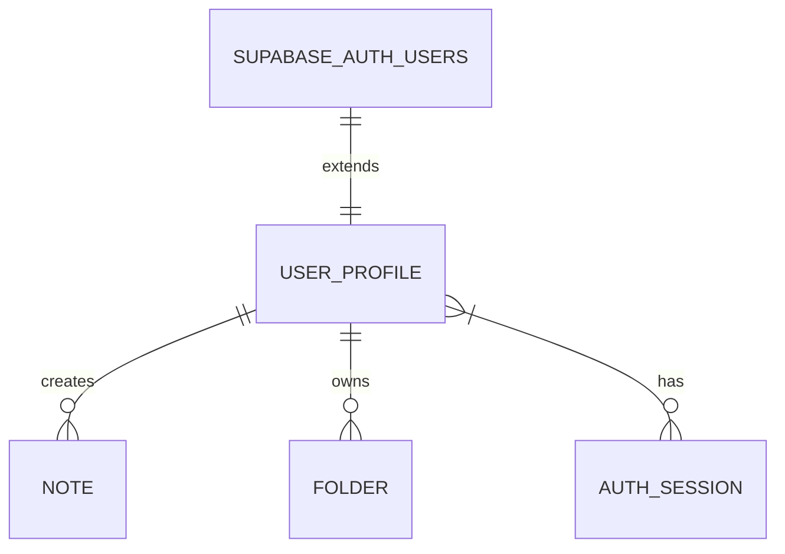
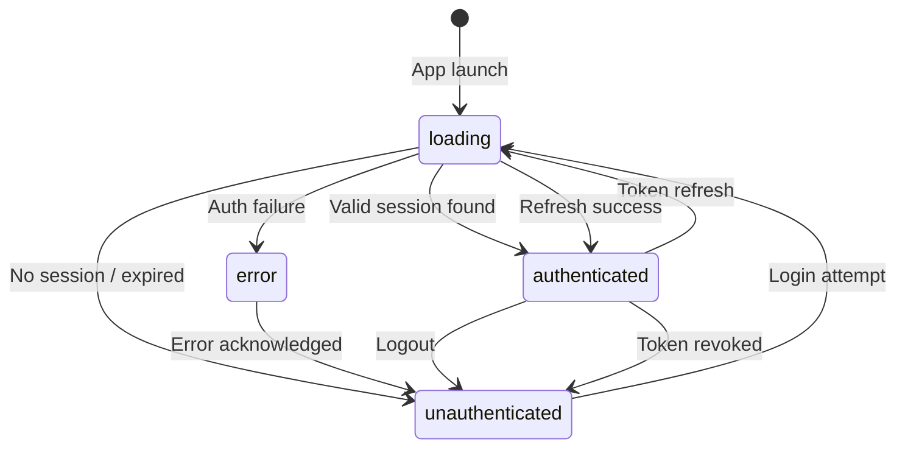
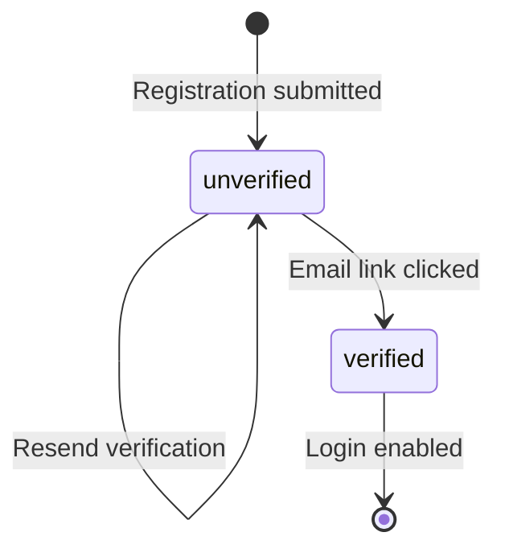

# Data Model: Authentication & User Management

**Feature**: 002-auth-user-management
**Date**: 2026-02-28

> This feature extends the `user_profile` table created in 001-Foundation
> by adding authentication-specific fields. It also introduces RLS policies
> and a Supabase Storage bucket for avatars.

## Entity Relationship Diagram

## Entities

### user_profile (extended from 001-Foundation)

New columns added by this feature:

| Column            | Type     | Constraints                   | Notes                            |
|-------------------|----------|-------------------------------|----------------------------------|
| auth_provider     | TEXT     | NOT NULL, DEFAULT 'email'     | email / google                   |
| email_verified    | BOOLEAN  | NOT NULL, DEFAULT FALSE       | True after email link clicked    |

> Existing columns (id, email, display_name, avatar_url, level, total_xp,
> created_at, updated_at, version) remain unchanged from 001 schema.

### auth_state (domain-only, not persisted)

This is an in-memory domain entity, not a database table.

| Field           | Type   | Notes                                      |
|-----------------|--------|--------------------------------------------|
| status          | Enum   | authenticated / unauthenticated / loading / error |
| user            | Object | Reference to UserProfile (nullable)        |
| error_message   | String | Human-readable error (nullable)            |

### user_session (domain-only, not persisted)

Supabase manages sessions server-side. This domain entity represents
the local view of a session.

| Field           | Type     | Notes                                    |
|-----------------|----------|------------------------------------------|
| user_id         | TEXT     | Reference to user_profile.id             |
| auth_provider   | TEXT     | email / google                           |
| access_token    | TEXT     | JWT (stored in secure storage)           |
| refresh_token   | TEXT     | Stored in secure storage                 |
| expires_at      | DATETIME | Token expiration timestamp               |
| is_active       | BOOLEAN  | Whether session is currently valid       |

## Supabase-Side Schema

### RLS Policies for user_profile

| Policy Name               | Operation | Rule                                    |
|---------------------------|-----------|------------------------------------------|
| Users read own profile    | SELECT    | `auth.uid() = id`                        |
| Users update own profile  | UPDATE    | `auth.uid() = id`                        |
| Users insert own profile  | INSERT    | `auth.uid() = id`                        |
| Users delete own profile  | DELETE    | Denied (handled via Edge Function only)  |

### Storage Bucket: avatars

| Setting           | Value                                  |
|-------------------|----------------------------------------|
| Bucket name       | `avatars`                              |
| Public            | Yes (read)                             |
| Max file size     | 5 MB                                   |
| Allowed MIME      | image/jpeg, image/png, image/webp      |
| Upload path       | `{user_id}/profile.{ext}`             |
| RLS (upload)      | `auth.uid() = path_tokens[1]`         |
| RLS (delete)      | `auth.uid() = path_tokens[1]`         |

### Edge Function: delete-account

| Attribute     | Value                                          |
|---------------|------------------------------------------------|
| Name          | `delete-account`                               |
| Method        | POST                                           |
| Auth          | JWT required (validates caller identity)        |
| Service key   | Used server-side for admin.deleteUser()         |
| Deletion order| sync_queue → quiz_questions → quizzes → flashcards → feynman_sessions → notes → folders → achievements → daily_goals → streaks → storage(avatars) → user_profile → auth.users |
| Response      | `{ success: boolean, message: string }`        |

## Validation Rules

| Entity          | Rule                                             |
|-----------------|--------------------------------------------------|
| user_profile    | `email` MUST be non-empty, valid email format    |
| user_profile    | `auth_provider` MUST be one of: email, google    |
| user_profile    | `display_name` length 0–100 characters           |
| user_profile    | `avatar_url` MUST be valid URL or null           |
| password        | Minimum 8 characters, ≥1 uppercase, ≥1 lowercase, ≥1 digit |
| avatar upload   | Max 5 MB, MIME in [image/jpeg, image/png, image/webp] |

## State Transitions

### auth_state.status

### Email Verification Flow

